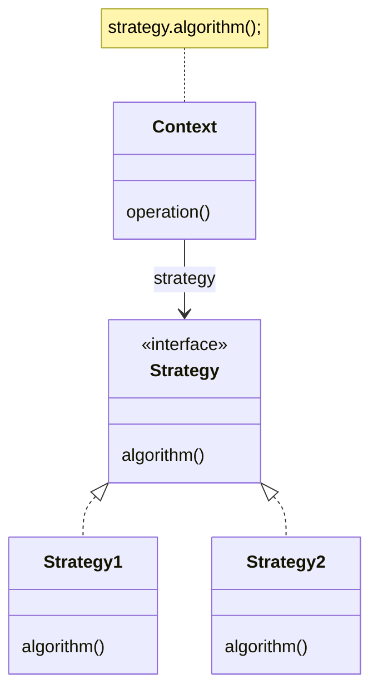
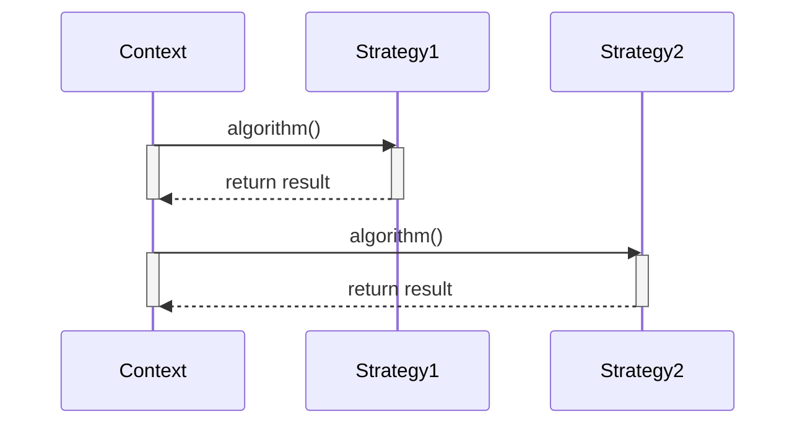

## 简介

wiki: https://en.wikipedia.org/wiki/Strategy_pattern

在计算机编程中，策略模式是一种行为型设计模式，可以在运行时选择算法。代码不是直接实现单个算法，而是接收运行时指令，以确定要在一系列算法中使用哪个算法。

策略允许算法独立于使用它的客户端而变化。将使用哪种算法的决定推迟到运行时，可以使调用代码更加灵活和可重用。
## 核心

- **Context** 上下文：维护对策略对象的引用，并提供给客户端使用。
- **Strategy** 策略接口：定义所有支持的算法的公共接口。
- **ConcreteStrategy** 具体策略：实现策略接口的具体类。
## 应用场景

策略模式非常适用于有多种类似行为或算法的系统中。
## 结构

### UML

类并不直接实现算法。而是指执行算法的接口()，这使得算法的实现方式无关。而类实现了接口，即实现(封装）一个算法。
### 时序

对象将算法委托给不同的对象。首先，调用一个对象，该对象执行算法并将结果返回给 。此后，改变其策略并调用一个对象，该对象执行算法并将结果返回给

## 策略模式与开闭原则

根据策略模式，类的行为不应该被继承。相反，它们应该使用接口进行封装。这与开放/封闭原则（OCP）兼容，该原则建议类应该对扩展开放，但对修改封闭。